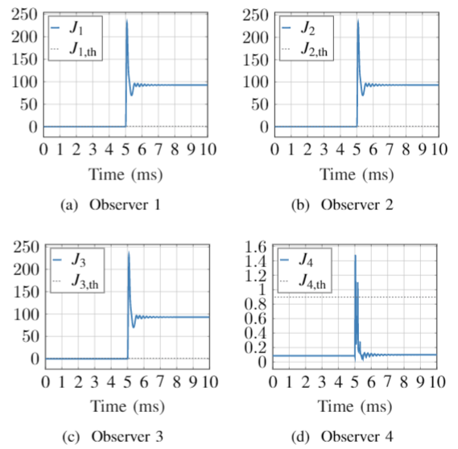
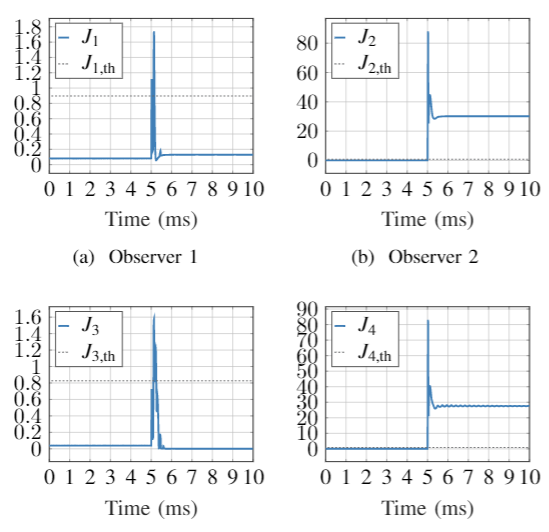
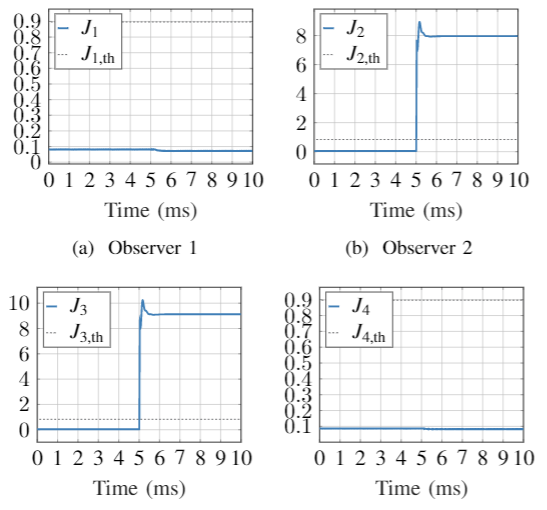

# External-Data

## Short-circuit fault in Cable 1 (F4)

fault signature of F4: [1,1,1,0] 

## Short-circuit fault in Busbar 1 (F7)

fault signature of F4: [0,1,0,1] 

## Load component fault in RL (F10)

fault signature of F4: [0,1,1,0] 

